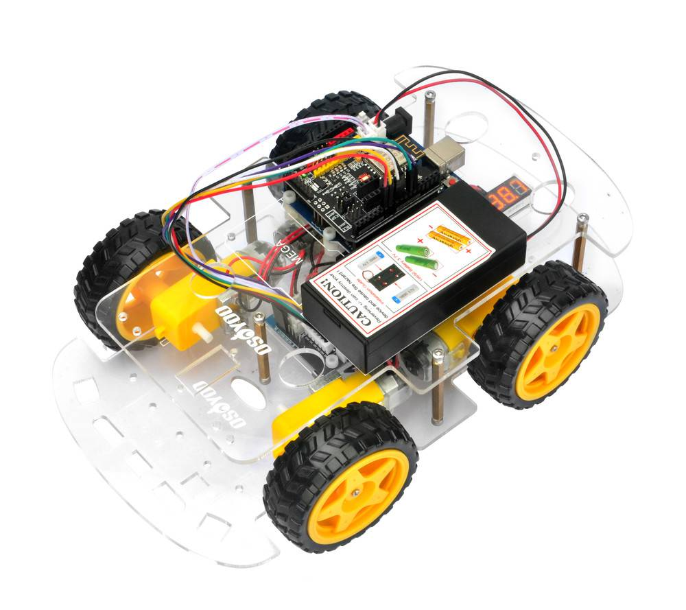

# Robots and Drones
Docs and stuff about robotics and drones

## Osoyoo Robot Car v2.1



See osoyoo-v2-1-robot-car folder for installation and tutorial or [Osoyoo Website](https://osoyoo.com/2020/05/12/v2-1-robot-car-kit-for-arduino-tutorial-introduction/).

Notes:
- [Arduino Software](https://www.arduino.cc/en/software/)
- Osoyoo Arduino UNO :
  - Microcontroller: ATmega328P-PU
  - Clock Speed: 16 MHz
  - SRAM: 2 KB (ATmega328)
  - EEPROM: 1 KB (ATmega328)
  - Flash Memory: 32 KB of which 0.5 KB used by bootloader
  - Operating Voltage: 5V
  - Input Voltage (recommended): 7-12V
  - Input Voltage (limits): 6-20V
  - Digital I/O Pins: 14 (of which 6 provide PWM output)
  - Analog Input Pins: 6
  - DC Current per I/O Pin: 40 mA
  - DC Current for 3.3V Pin: 50 mA

Upload Code lesson 1:
```
Le croquis utilise 1408 octets (4%) de l'espace de stockage de programmes. Le maximum est de 32256 octets.
Les variables globales utilisent 9 octets (0%) de mémoire dynamique, ce qui laisse 2039 octets pour les variables locales. Le maximum est de 2048 octets.
```
